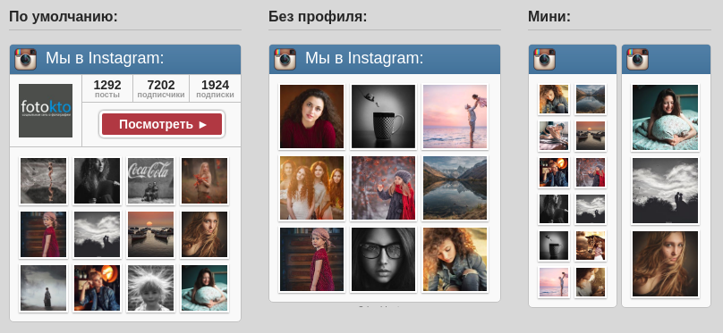

# Mihdan: InWidget
WordPress-плагин для транслирования ваших фотографий из Instagram прямо на вашем сайте.

Работает на основе [InWidget](https://github.com/aik27/inwidget) Александра ([aik27](https://github.com/aik27)) за что ему огромное спасибо.

# Внешний вид

# История версий
## 1.2.1 ##

* Исправлена ошибка 500: Account with this username does not exist при использовании недокументированного API. Была связана с тем, что Instagram внёс изменения.
* В данной версии нельзя извлечь более 12 фото из аккаунта при использовании недокументированного API (при поиске по тегам можно). Решение в процессе поиска.
* Добавлен украинский язык
* Добавлен учёт внешних отступов для внутреннего контейнера в адаптивном режиме

## 1.2.0 ##
* Добавлена поддержка официального API Instagram. Чтобы использовать его укажите ACCESS TOKEN в config.php
* Добавлена возможность выбирать фотографии по тегам только из аккаунта. Для этого используйте опцию "tagsFromAccountOnly" в config.php
* Переработана структура классов для поддержки нескольких API одновременно

## 1.1.9 ##
* Переработан механизм ошибок. Теперь виджет бросает исключения вместо остановки работы с помощью die()
* Убрана необходимость использовать autoloader совместно с instagram-php-scraper
* Изменился путь к библиотеке Unirest
* Изменилось название директории с языками
* Обновлена библиотека instagram-php-scraper до версии 0.8.11.
